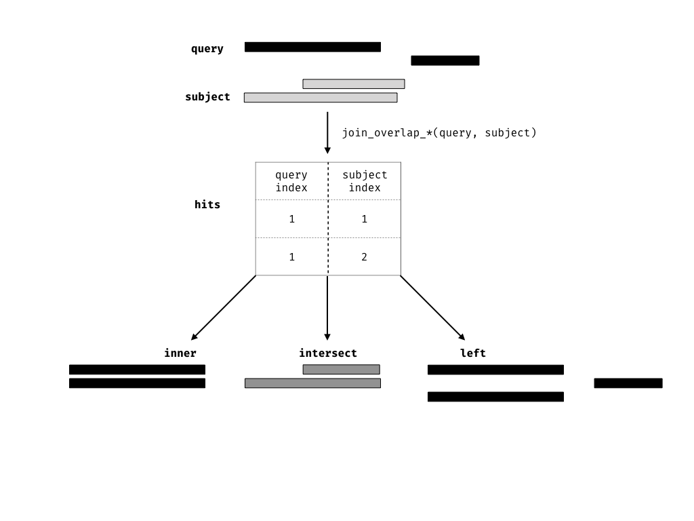

```{r setup, include = FALSE}
library(tibble)
library(knitr)
opts_chunk$set(message = FALSE, 
               warning = FALSE, 
               comment = "#>", 
               fig.width = 5, 
               fig.height = 3, 
               fig.align = "center")
# for peak figures
library(ggbio)

# for bam example
library(Biostrings)
library(plyranges)

# -- Data from the Human Epigenomics RoadMap consortium
# retrieving a BigWigFile from AnnotationHub

if (!dir.exists("./data")) dir.create("./data")

library(AnnotationHub)
q <- AnnotationHub()
# T-cell BW file
bw_file <- q[["AH33458"]] 

# a BamFile from the H1 cell line
h1_bam <- "./data/GSM433167_BI.H3K27me3.bam"
if (!file.exists(h1_bam))
  download.file(
    url = "ftp://ftp.ncbi.nlm.nih.gov/geo/samples/GSM433nnn/GSM433167/suppl/GSM433167%5FBI%2EH3K27me3%2Ebam",
    destfile = h1_bam
  )

h1_bam_sorted <- "./data/GSM433167_BI.H3K27me3.sorted.bam"

# sort and index bam
if (!file.exists(h1_bam_sorted)) {
  Rsamtools::sortBam(h1_bam, "./data/GSM433167_BI.H3K27me3.sorted")
  Rsamtools::indexBam(h1_bam_sorted)
}

# array data for h1 cell line
# illumina annotations
array_info <- "data/GPL18952_HumanOmni25M-8v1-1_B.annotated.txt.gz"
if (!file.exists(array_info)) 
  download.file(
    url = "https://www.ncbi.nlm.nih.gov/geo/download/?acc=GPL18952&format=file&file=GPL18952%5FHumanOmni2%2D5%2D8%2Dv1%2D1%2DC%2Ecsv%2Egz",
    destfile = array_info
  )

snp_info <- "data/GSM1463263_JS-ESCH1.txt.gz"
if (!file.exists(snp_info))
  download.file(
    url = "https://www.ncbi.nlm.nih.gov/geo/download/?acc=GSM1463263&format=file&file=GSM1463263%5FJS%2DESCH1%2Etxt%2Egz",
    destfile = snp_info
  )

```
# Background

High-throughput genomics promises to unlock new disease therapies,
and strengthen our knowledge of basic biology. To deliver on those promises, 
scientists must derive a stream of knowledge from a deluge of data. Genomic 
data is challenging in both scale and complexity. Innovations in sequencing 
technology often outstrip our capacity to process the output. Beyond their common
association with genomic coordinates, genomic data are heterogeneous,
consisting of raw sequence read alignments, genomic feature
annotations like genes and exons, and summaries like coverage vectors,
ChIP-seq peak calls, variant calls, and per-feature read
counts. Genomic scientists need software tools to wrangle the
different types of data, process the data at scale, test hypotheses,
and generate new ones, all while focusing on the biology, not the
computation. For the tool developer, the challenge is to define ways
to model and operate on the data that align with the mental model of
scientists, and to provide an implementation that scales with their
ambition.

Several domain specific languages (DSLs) enable scientists to process and reason
about heterogeneous genomics data by expressing common
operations, such as range manipulation and overlap-based joins, using
the vocabulary of genomics. Their implementations either delegate
computations to a database, or operate over collections of files in
standard formats like BED. An example of the former is the Genome Query 
Language (GQL) and its distributed implementation GenAp which use a 
SQL-like syntax for fast retrieval of information of unprocessed 
sequencing data [@Kozanitis2014-va; @Kozanitis2016-bm]. Similarly, the Genometric 
Query Language (GMQL) implements a relational algebra for combining genomic datasets 
\cite{Kaitoua2017-pw}.  The command line application BEDtools develops an extensive 
algebra for performing arithmetic between two or more sets of genomic regions 
\cite{Quinlan2010-gc}. All of the aforementioned DSLs are designed to be evaluated
either at the command line or embedded in scripts for batch processing. They 
exist in a sparse ecosystem, mostly consisting of UNIX and database tools that
lack biological semantics and operate at the level of files and
database tables.

The Bioconductor/R packages `IRanges` and `GenomicRanges` 
[@r-core; @Lawrence2013-wg; @Huber2015-ei] define a DSL for 
analysing genomics data with R, an interactive data analysis environment that 
encourages reproducibility and provides high-level abstractions for manipulating,
modelling and plotting data, through state of the art methods in
statistical computing. The packages define object-oriented (OO)
abstractions for representing genomic data and enable
interoperability by allowing users and developers to use these
abstractions in their own code and packages. Other genomic DSLs 
that are embedded in programming languages include pybedtools and valr 
[@Dale2011-js; @Kent2017], however these packages lack the interoperability
provided by the aforementioned Bioconductor packages and are not easily 
extended.

The Bioconductor infrastructure models the genomic data and operations from the
perspective of the power user, one who understands and wants to take
advantage of the subtle differences in data types. This design has
enabled the development of sophisticated tools, as evidenced by the
hundreds of packages depending on the framework. Unfortunately, the
myriad of data structures have overlapping purposes and important but
obscure differences in behavior that often confuse the typical end
user.

Recently, there has been a concerted, community effort to standardize
R data structures and workflows around the notion of tidy data
\cite{Wickham2014-jc}. A tidy dataset is defined as a tabular
data structure that has observations as rows and columns as variables,
and all measurements pertain to a single observational unit.
The tidy data pattern is useful because it allows 
us to see how the data relate to the design of an experiment
and the variables measured. The `dplyr` package \cite{Wickham2017-dplyr} 
defines an API that maps notions from the general relational algebra to 
operations on tidy data. It expresses each operation as a cohesive, endomorphic
verb. Taken together these features enable a user to write human
readable analysis workflows.

We have created a genomic DSL called `plyranges` that reformulates
notions from existing genomic algebras and embeds them in R as a
genomic extension of `dplyr`. By analogy, `plyranges` is to the
genomic algebra, as `dplyr` is to the relational algebra.  The
`plyranges` Bioconductor package implements the language on top of a
key subset of Bioconductor data structures and thus fully integrates
with the Bioconductor framework, gaining access to its scalable data
representations and sophisticated statistical methods.

# Results

## Genomic Relation Algebra

### Data Model

\begin{figure}
\includegraphics[width=\textwidth]{diagrams/GRanges}
\caption{An illustration of the GRanges data model for a
sample from an RNA-seq experiment. The core components of the data model
include a seqname column (representing the chromosome), a ranges column
which consists of start and end coordinates for a genomic region, and a
strand identifier (either positive, negative, or unstranded). Metadata
are included as columns to the right of the dotted line as annotations
(gene\_id) or range level covariates (score).}
\label{fig:GRanges} 
\end{figure}

The `plyranges` DSL is built on the core Bioconductor data structure
GRanges, which is essentially a constrained table, with fixed columns
for the chromosome, start and end coordinates, and the strand, along
with an arbitrary set of additional columns, consisting of
measurements or metadata specific to the data type or experiment
(figure \ref{fig:GRanges}).  GRanges balances flexibility with formal
constraints, so that it is applicable to virtually any genomic
workflow, while also being semantically rich enough to support
high-level operations on genomic ranges. As a core data structure,
GRanges enables interoperability between `plyranges` and the rest of
Bioconductor. Adhering to a single data structure simplifies the API
and makes it easier to learn and understand, in part because
operations become endomorphic, i.e., they return the same type as
their input.

GRanges follows the intuitive tidy data pattern: it is a rectangular
table corresponding to a single biological context. Each row contains
a single observation and each column is a variable describing the
observations.  GRanges specializes the tidy pattern in that the
observations always pertain to some genomic feature, but it largely
remains compatible with the general relational operations defined by
dplyr. Thus, we define our algebra as an extension of the `dplyr`
algebra, and borrow its syntax conventions and design principles.

\begin{table}[!htbp]
\centering
\begin{tabular}{|l|l|p{6cm}|}
  \hline
  & Verb &  Description \\ 
  \hline
   & \textbf{\emph{summarise()}} & aggregate over column(s) \\ 
   Aggregation & \emph{disjoin\_ranges()} & aggregate column(s) over the union of end coordinates \\
   &  \emph{reduce\_ranges()} & aggregate column(s) by merging overlapping and neighbouring ranges \\
   \hline
   &  \textbf{\emph{mutate()}} & modifies any column \\
   & \textbf{\emph{select()}} & select columns \\
  Arithmetic (Unary) & \textbf{\emph{arrange()}} & sort by columns \\
   & \emph{stretch()} & extend range by fixed amount \\
   &  \emph{shift\_(direction)} & shift coordinates \\
   & \emph{flank\_(direction)} & generate flanking regions \\
   & \emph{\%intersection\% } & row-wise intersection \\
   & \emph{\%union\%} & row-wise union \\
   & \emph{compute\_coverage} & coverage over all ranges \\
  Arithmetic (Binary) &  \emph{\%setdiff\%} & row-wise set difference \\
   & \emph{between()} & row-wise gap range \\
   & \emph{span()} & row-wise spanning range \\
   \hline
    & \emph{join\_overlap\_*()} & merge by overlapping ranges \\
    & \emph{join\_nearest} & merge by nearest neighbour ranges \\
    & \emph{join\_follow} & merge by following ranges \\
    Merging & \emph{join\_precedes} & merge by preceding ranges \\
    & \emph{union\_ranges} & range-wise union \\
    & \emph{intersect\_ranges} & range-wise intersect \\
    & \emph{setdiff\_ranges} & range-wise set difference \\
    & \emph{complement\_ranges} & range-wise union \\
  \hline
   & \emph{anchor\_direction()} & fix coordinates at direction \\
  Modifier & \textbf{\emph{group\_by()}} & partition by column(s)  \\ 
   & \emph{group\_by\_overlaps()} & partition by overlaps \\
   \hline
   & \textbf{\emph{filter()}} & subset rows \\
  Restriction & \emph{filter\_by\_overlaps()} & subset by overlap \\
    & \emph{filter\_by\_non\_overlaps()} & subset by no overlap \\
   \hline
\end{tabular}
\caption{Overview of the \texttt{plyranges} grammar. The core verbs are
briefly described and categorised into one of: aggregation, unary or binary
arithmetic, merging, modifier, or restriction. A verb is given bold text if
its origin is from the \texttt{dplyr} grammar.}\label{tab:grammar}
\end{table}

### Algebraic operations

The `plyranges` DSL defines an expressive algebra for performing
genomic operations with and between GRanges objects (see table
\ref{tab:grammar}). The grammar includes several classes of operation
that cover most use cases in genomics data analysis. There are
range arithmetic operators, such as for resizing ranges or finding their
intersection, and operators for merging, filtering and aggregating by
range-specific notions like overlap and proximity.

Arithmetic operations transform range coordinates, as defined by their
_start_, _end_ and _width_. The three dimensions are mutually
dependent and partially redundant, so direct manipulation of them is
problematic. For example, changing the _width_ column needs to change
either the _start_, _end_ or both to preserve integrity of the
object. We introduce the _anchor_ modifier to disambiguate these
adjustments. Supported anchor points include the start, end and
midpoint, as well as the 3' and 5' ends for strand-directed
ranges. For example, if we anchor the start, then setting the width
will adjust the end while leaving the start stationary.

The algebra also defines conveniences for relative coordinate
adjustments: _shift_ (unanchored adjustment to both start and end) and
_stretch_ (anchored adjustment of width). We can perform any relative
adjustment by some combination of those two operations.  The _stretch_
operation requires an anchor and assumes the midpoint by
default. Since _shift_ is unanchored, the user specifies a suffix for
indicating the direction: left/right or, for stranded features,
upstream/downstream. For example, _shift\_right_ shifts a range to the
right.

The _flank_ operation generates new ranges that are adjacent to
existing ones. This is useful, for example, when generating upstream
promoter regions for genes. Analogous to _shift_, a suffix indicates
the side of the input range to flank.

As with other genomic grammars, we define set operations that treat
ranges as sets of integers, including _intersect_, _union_,
_difference_, and _complement_. There are two sets of these: parallel
and merging. For example, the parallel intersection (_x %intersect% y_) finds the
intersecting range between _xi_ and _yi_ for _i_ in _1...n_, where _n_
is the length of both _x_ and _y_. In contrast, the merging
intersection (_intersect\_ranges(x, y)_) returns a new set of disjoint
ranges representing wherever there was overlap between a range in _x_
and a range in _y_. Finding the parallel union will fail when two ranges
have a gap, so we introduce a _span_ operator that takes the union
while filling any gap. The _complement_ operation is unique in that it
is unary. It finds the regions not covered by any of the ranges in a
single set. Closely related is the _between_ parallel operation, which
finds the gap separating _xi_ and _yi_. The binary operations are
callable from within arithmetic, restriction and aggregation
expressions.

To support merging, our algebra recasts finding overlaps or 
nearest neighbours between two
genomic regions as variants of the relational join operator. A join
acts on two GRanges objects, a query and a subject. The join operator
is relational in the sense that metadata from the query and subject
ranges is retained in the joined range.  All join operators in the
`plyranges` DSL generate a set of hits based on overlap or proximity
of ranges and use those hits to merge the two datasets in different
ways. There are four supported matching algorithms: _overlap_,
_nearest_, _precede_, and _follow_ (figures 
\ref{fig:olaps-fig} and \ref{fig:nn-fig}). We can further restrict the
matching by whether the query is completely _within_ the subject, and
adding the _directed_ suffix ensures that matching ranges have the
same direction (strand).

```{r olaps-fig, echo = FALSE, out.width="\\textwidth", fig.cap="Illustration of the three overlap join operators. Each join takes query and subject range as input (black and light gray rectangles, respectively). An index for the join is computed, returning a Hits object, which contains the indices of where the subject overlaps the query range. This index is used to expand the query ranges by where it was 'hit' by the subject ranges. The join semantics alter what is returned: for an \\textbf{inner} join the query range is returned for each match, for an \\textbf{intersect} the intersection is taken between overlapping ranges, and for a \\textbf{left} join all query ranges are returned even if the subject range does not overlap them. This principle is gnerally applied through the `plyranges` DSL for both overlaps and nearest neighbour operations."}

```

For merging based on the hits, we have three modes: _inner_,
_intersect_ and _left_. The _inner_ overlap join is similar to the
conventional inner join in that there is a row in the result for every
match. A major difference is that the matching is not by identity, so
we have to choose one of the ranges from each pair. We always choose
the left range. The _intersect_ join uses the intersection instead of
the left range. Finally, the overlap _left_ join is akin to left outer
join in Cobb's relational algebra: it performs an overlap inner join
but also returns all query ranges that are not hit by the subject.

```{r nn-fig, echo = FALSE, out.width = "\\textwidth", fig.cap="Illustration of neighbour finding joins. Each join takes a query and subject range and computes a 'Hits' object. For the \\textbf{nearest} join all query ranges are returned as they are all nearest neighbours of the second subject range. For the \\textbf{follow} join there is only one query range that follows any subject range. Likewise for the \\textbf{precede} join, there is only one query range that precedes a subject range."}
knitr::include_graphics("diagrams/diagrams-003.png")
```

Since the GRanges object is a tabular data structure, our grammar includes
operators to filter, sort and aggregate by columns in a GRanges. These 
operations can be performed over partitions formed
using the *group_by* modifier. Together with our algebra for arithmetic and
merging, these operations conform to the semantics and syntax of the 
`dplyr` grammar.

## Developing workflows with `plyranges`

Here we provide illustrative examples of using the `plyranges` DSL to show
how our grammar could be integrated into genomic data workflows. We also
highlight how interoperability with existing Bioconductor infrastructure, 
enables easy access to public datasets and methods for analysis and 
visualisation.

### Peak Finding

In the workflow of ChIP-seq data analysis, we are interested in finding peaks 
from islands of coverage over chromosome. Here we will use `plyranges`
to call peaks from islands of coverage above 8 then plot the region
surrounding the tallest peak.

Using `plyranges` and the the Bioconductor package `AnnotationHub` \cite{R-ahub}
we can download and read BigWig files from ChIP-Seq experiments from 
the Human Epigenome Roadmap project \cite{Roadmap-Epigenomics-Consortium2015-pr}. 
Here we analyse a BigWig file corresponding to H3 lysine 27 trimethylation 
(H3K27Me3) of primary T CD8+ memory cells from peripheral blood, focussing
on coverage islands over chromosome 10. 

First, we extract the genome information from the BigWig file and filter
to get the range for chromosome 10. This range will be used as a filter when 
reading the file.

```{r load-bw, cache = TRUE}
library(plyranges)
chr10_ranges <- bw_file %>% 
  get_genome_info() %>%
  filter(seqnames == "chr10")
```

Then we read the BigWig file only extracting scores if they overlap chromosome
10. We also add the genome build information to the resulting ranges. This
book-keeping is good practice as it ensures the integrity of any 
downstream operations such as finding overlaps.

```{r}
chr10_scores <- bw_file %>%
  read_bigwig(overlap_ranges = chr10_ranges) %>%
  set_genome_info(genome = "hg19")
```

After filtering for regions with a coverage score greater than 8, we can
reduce individual runs to ranges representing the islands of coverage by
using the `reduce_ranges()` function. This function allows a summary
to be computer over each island: in this case we take the maximum of 
the scores to find the coverage peaks over chromosome 10.

```{r}
all_peaks <- chr10_scores %>% 
  filter(score > 8) %>% 
  reduce_ranges(score = max(score))
```

Returning to the GRanges object containing normalised coverage scores, 
we filter to find the coordinates of the peak containing the maximum coverage 
score. We can then find a 5000 nt region centered around the maximum position 
by anchoring and modifying the width. 

```{r max-score-region}
chr10_max_score_region <- chr10_scores %>%
  filter(score == max(score)) %>% 
  anchor_center() %>%
  mutate(width = 5000)
```

Finally, the overlap inner join is used to restrict the chromosome 10
coverage islands, to the islands that are contained in the 5000nt region that surrounds the max peak (figure \ref{fig:peak-viz}).

```{r peak_region}
peak_region <- chr10_scores %>%
  join_overlap_inner(chr10_max_score_region)

```

```{r peak-viz, echo = FALSE, fig.cap = "The final result of the \\texttt{plyranges} operations to find a 5000nt region surrounding the peak of normalised coverage scores over chromosome 10, displayed as a density plot.", cache = TRUE}
ggbio::autoplot(peak_region, 
                aes(y = score.x), 
                geom = "blank") + 
  geom_area() +
  ylab("score")
```

### Computing Windowed Statistics

Another common operation in genomics data analysis is to compute data
summaries over genomic windows. In `plyranges` this can be achieved
via the `group_by_overlaps()` operator.  We bin and count and
find the average GC content of reads from a
H3K27Me3 ChIP-seq experiment by the Human Epigenome Roadmap
Consortium.

We can directly obtain the genome information from the header of the
BAM file: in this case the reads were aligned to the hg19 genome build
and there are no reads overlapping the mitochondrial genome. To generate 
bins of fixed width 10000nt we apply the `tile_ranges()` function
to the genomic coordinates in locations.
```{r bins}
locations <- h1_bam_sorted %>%
  read_bam() %>% 
  get_genome_info() 

bins <- locations %>% 
  tile_ranges(width = 10000L)
```

Next we only read in alignments that overlap the genomic locations
we are interested in and select the query sequence. Note that
the reading of the BAM file is deferred: only alignments that pass the filter 
are loaded into memory. We can add another column representing the GC proportion 
for each alignment using the `letterFrequency()` function from the `Biostrings`
package \cite{R-biostrings}.

```{r, cache = TRUE}
alignments <- h1_bam_sorted %>% 
  read_bam() %>%
  filter_by_overlaps(locations) %>%
  select(seq) %>%
  mutate(score = as.numeric(letterFrequency(seq, "GC", as.prob = TRUE)))
```

Finally, we use `group_by_overlaps()` to see where the alignments overlap the 
genomic windows and then apply `summarize()` to compute the
total number of reads and average GC content within each window.

```{r, cache = TRUE}
alignments_summary <- bins %>%
  group_by_overlaps(alignments %>% select(score)) %>% 
  summarize(n_reads = n(), avg_gc = mean(score))
```
<!-- 
https://support.bioconductor.org/p/71601/ also useful example?
-->
### Quality Control Metrics

```{r, echo = FALSE, warning = FALSE, cache = TRUE}
# prepare a GRanges object from array data
library(readr)
# annotation information available here
# https://www.ncbi.nlm.nih.gov/geo/query/acc.cgi?acc=GPL18952
# chromosome zero are 'problem' probes and should be filtered
anno <- read_tsv(array_info,
                 trim_ws = TRUE,
                 col_types = c("cccc----")) %>%
  dplyr::filter(Chr != "0")

# genotypes for H1 cell line, data starts on line 10
# data obtained from https://www.ncbi.nlm.nih.gov/geo/query/acc.cgi?acc=GSM1463263
geno <- read_tsv(snp_info, skip = 10) 

# rename columns
geno <- geno %>% 
  dplyr::select(name = `SNP Name`, 
         score = `GC Score`, 
         baf = `B Allele Freq`, 
         logR = `Log R Ratio`)

# merge everything
complete_vranges_df <- dplyr::inner_join(geno, anno, by = c("name" = "Name")) %>%
  dplyr::rename(alleles = Alleles, seqnames = Chr, start = MapInfo)

h1_snp_array <- as_granges(complete_vranges_df,
                           start = as.integer(start),
                           end = as.integer(start))
h1_snp_array <- h1_snp_array %>% 
  mutate(ref = stringr::str_replace(alleles, "\\[(.)/.*", "\\1"),
         alt = stringr::str_replace(alleles, ".*/(.)\\]", "\\1"))
```

We have created a GRanges object from genotyping performed on the
H1 cell line, consisting of approximately two million single nucleotide
polymorphisms (SNPs) and short insertion/deletions (indels). The GRanges object consists
of 7 columns, relating to the alleles of a SNP or indel, the B-allele frequency,
log relative intensity of the probes, GC content score over a probe, and the
name of the probe. We can use this information to compute the transition-transversion
ratio, a quality control metric, within each chromosome in GRanges object.

First we filter out the indels and mitochondrial variants. Then we
create a logical vector corresponding to whether there is a transition
event.

```{r, cache = TRUE}
h1_snp_array <- h1_snp_array %>%
  filter(!(ref %in% c("I", "D")), seqnames != "M") %>%
  mutate(transition = (ref %in% c("A", "G") & alt %in% c("G","A"))|
                      (ref %in% c("C","T") & alt %in% c("T", "C")))
```

We then compute the transition-transversion ratio over each chromosome using
`group_by()` in combination with `summarize()` (figure \ref{fig:titv-viz}).

```{r, cache = TRUE}
ti_tv_results <- h1_snp_array %>% 
  group_by(seqnames) %>%
  summarize(n_snps = n(),
            ti_tv = sum(transition) / sum(!transition)) 
```

```{r titv-viz, echo = FALSE, fig.cap = "The final result of computing quality control metrics over the SNP array data with \\texttt{plyranges}, displayed as a dot plot. Chromosomes are ordered by their estimated transition-transversion ratio. A white reference line is drawn at the expected ratio for a human exome."}
ti_tv_results %>% 
  as.data.frame() %>% 
  ggplot(aes(forcats::fct_reorder(seqnames, ti_tv), ti_tv)) +
  geom_point() + 
  geom_hline(yintercept = 3, colour = "white", size = 4) +
  labs(x = "Chromosome", y = "Transition Transversion Ratio") +
  coord_flip() 
```
<!-- 
Trivial example? Could do something with a smooth summarised over
genomic coordinates? 
-->

# Discussion 

The design of `plyranges` adheres to well understood principles of
language and API design: cognitive consistency, cohesion,
expressiveness and endomorphism \cite{Green1996-qg}. 
To varying degrees, these principles also underlie the
design of `dplyr` and the Bioconductor infrastructure.

We have aimed for `plyranges` to have a simple and direct mapping to the
user's cognitive model, i.e., how the user thinks about the data. This
requires careful selection of the level of abstraction so that the
user can express workflows in the language of genomics. This motivates
the adoption of the tidy GRanges object as our central data
structure. The basic data.frame and `dplyr` tibble lack any notion of
genomic ranges and so could not easily support our genomic grammar,
with its specific verbs for range-oriented data manipulation. Another
example of cognitive consistency is how `plyranges` is insensitive to
direction/strand by default when, e.g., detecting
overlaps. `GenomicRanges` has the opposite behavior. We believe that
defaulting to purely spatial overlap is most intuitive to most users.

<!--
ML:
Hadley actually presents dplyr as a 'cognitive tool', i.e., something
that helps users think about the problem. In my opinion, the best we
can do is attempt to match the intuition of the user, so when the user
decides what to do, there is an obvious way of doing it. I'm not ready
to claim that the user should start from our grammar.
-->

Like `dplyr`, `plyranges` verbs are functional: they are free of side
effects and return their result. This enables chaining of verbs
through syntax like the forward pipe operator (`%>%`, read as "then")
of the `magrittr` package \cite{R-magrittr}. This has syntax has a direct
cognitive mapping to natural language and the intuitive notion of
pipelines. The low-level object-oriented APIs of Bioconductor tend to
manipulate data via sub-replacement functions, like `start(gr) <-
x`. These ultimately produce the side effect of replacing a symbol
mapping in the current environment and thus are not amenable to
so-called fluent syntax.

A function is cohesive if it performs a singular task without
producing any side-effects. Singular tasks can always be broken 
down further at lower levels of abstraction.
For example, to resize a range, the user needs to specify which
position (start, end, midpoint) should be invariant over the
transformation. The `resize()` function from the `GenomicRanges` package
has a `fix` argument that sets the anchor, so calling `resize()`
coalesces anchoring and width modification. The coupling at the
function call level is justified since the effect of setting the width
depends on the anchor. However, `plyranges` increases cohesion and
decouples the anchoring into its own function call. 

Increasing cohesion simplifies the interface to each operation, makes
the meaning of arguments more intuitive, and relies on function names
as the primary means of expression, instead of a more complex mixture
of function and argument names. This results in the
user being able to conceptualize the `plyranges` DSL as a flat catalog of 
functions, without having to descend further into documentation to understand
a function's arguments. A flat function catalog also enhances API
discoverability, particularly through auto-completion in IDEs. One
downside of pushing cohesion to this extreme is that function calls
become coupled, and care is necessary to treat them as a group when
modifying code.

Expressiveness relates to the information content in code: the
programmer should be able to clarify intent without unnecessary
verbosity. For example, our overlap-based join operations are more
concise than the multiple steps necessary to achieve the same effect
in the original `GenomicRanges` API. In other cases, the `plyranges` API
increases verbosity for the sake of clarity and cohesion. Explicitly
calling _anchor()_ can require more typing, but the code is easier to
comprehend. Another example is the set of routines for importing
genomic annotations, including _read\_gff()_, _read\_bed()_, and
_read\_bam()_. Compared to the generic _import()_ in `rtracklayer`, the
explicit format-based naming in `plyranges` clarifies intent and the
type of data being returned. Similarly, every `plyranges` function that
computes with strand information indicates its intentions by including
suffixes such as _directed_, _upstream_ or _downstream_ in its name,
otherwise strand is ignored. The `GenomicRanges` API does not make this
distinction explicit in its function naming, instead relying on a
parameter that defaults to strand sensitivity, an arguably unintuitive
behavior.

A caveat to constructing a compatible interface with `dplyr` is that
`plyranges` makes extensive use of non-standard evaluation in R via
the `rlang` package \cite{R-rlang}. Simply, this means that computations are
evaluated in the context of the GRanges objects. Both `dplyr` and
`plyranges` are based on the `rlang` language, because it allows for more
expressive code that is free of repeated references to the
container. Implicitly referencing the container is particularly
convenient when programming interactively.  Consequently, when
programming with `plyranges`, a user needs to generally understand
the `rlang` language and how to adapt their code accordingly. Users
familiar with the tidyverse should already have such knowledge.

# Conclusion

We have shown how to create expressive and 
reproducible genomic workflows using the `plyranges` DSL. By
realising that the GRanges data model is tidy we have highlighted how to 
implement a grammar for performing genomic arithmetic, aggregation, restriction 
and merging. Our examples show that `plyranges` code is succinct, human
readable and can take advantage of the interoperability provided by
the Bioconductor ecosystem and the R language.

We also note that the grammar elements and design principles we have described
are programming language agnostic and could be easily be implemented in another
language where genomic information could be represented as a tabular data
structure. We chose R because it is what we are familiar with and because
the aforementioned Bioconductor packages have implemented the GRanges data
structure.

We aim to continue developing the `plyranges` package and to extend it
for use with more complex data structures, such as the
SummarizedExperiment class, the core Bioconductor data structure for
representing experimental results (e.g., counts) from multiple sample
experiments in conjunction with feature and sample metadata. The
grammar and design of the `plryanges` DSL are naturally extensible to
SummarizedExperiment.

As the `plyranges` interface encourages tidy data practices, it
integrates well with the grammar of graphics \cite{Wickham2016-gz}.  To
achieve responsive performance, interactive graphics rely on lazy data
access and computing patterns, so the deferred mechanisms within
`plyranges` should help support interactive genomics applications.

The `plyranges` package can be obtained via the Bioconductor project
website [https://bioconductor.org](https://bioconductor.org) or
accessed via Github 
[https://github.com/sa-lee/plyranges](https://github.com/sa-lee/plyranges).


# Methods
## Data Availability
The BigWig file for the H3K27Me3 primary T CD8+ memory cells from peripheral 
blood ChIP-seq data was downloaded from the `AnnotationHub` package (2.12.0)
under accession AH33458. The BAM file corresponding to the
H1 cell line ChIP-seq data is available at GEO under accession GSM433167. 
The SNP array data for the H1 cell line data is available at GEO under accession
GSM1463263.

## Software Versions
To produce the workflows as described in results section we used 
R version 3.5 with the development version of `plyranges` (1.1.4) 
and the  `BioStrings` package (2.48.0) installed. 

All code required to reproduce this article is available at https://github.com/sa-lee/plyranges-paper.

# Acknowledgements

We would like to thank Dr Matthew Ritchie at the Walter and Eliza Hall 
Institute and Dr Paul Harrison for their feedback on earlier drafts of
this work. We would also like to thank Lori Shepherd and Hèrve Pages
for the code review they performed. This article was written with
`knitr` \cite{R-knitr} and the figures were made with `ggbio` \cite{R-ggbio}. 

# References {#references .unnumbered}
