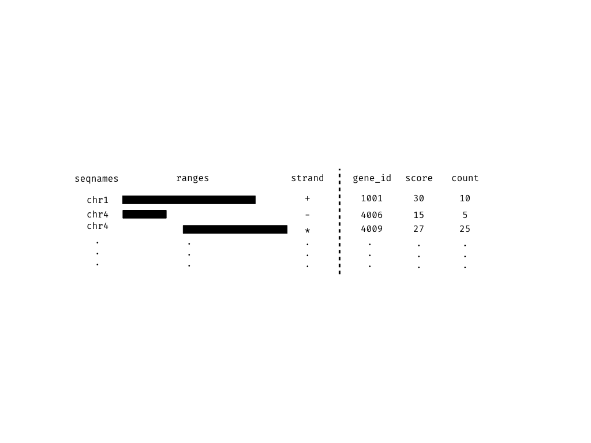

```{r setup, include = FALSE}
library(tibble)
library(knitr)
opts_chunk$set(message = FALSE, 
               warning = FALSE, 
               comment = "#>", 
               fig.width = 5, 
               fig.height = 3, 
               fig.align = "center")
# for peak figures
library(ggbio)

library(plyranges)

# -- Data from the Human Epigenomics RoadMap consortium
# retrieving a BigWigFile from AnnotationHub
library(AnnotationHub)
q <- AnnotationHub()
# T-cell BW file
bw_file <- q[["AH33458"]] 

# a BamFile from the H1 cell line
h1_bam <- "data/GSM433167_BI.H3K27me3.bam"
```
# Introduction

High-throughput genomics promises to unlock new disease therapies,
and strengthen our knowledge of basic biology. To deliver on those promises, 
scientists must derive a stream of knowledge from a deluge of data. Genomic 
data is challenging in both scale and complexity. Innovations in sequencing 
technology often outstrip our capacity to process the output. Beyond their common
association with genomic coordinates, genomic data are heterogeneous,
consisting of raw sequence read alignments, genomic feature
annotations like genes and exons, and summaries like coverage vectors,
ChIP-seq peak calls, variant calls, and per-feature read
counts. Genomic scientists need software tools to wrangle the
different types of data, process the data at scale, test hypotheses,
and generate new ones, all while focusing on the biology, not the
computation. For the tool developer, the challenge is to define ways
to model and operate on the data that align with the mental model of
scientists, and to provide an implementation that scales with their
ambition.

Several domain specific languages (DSLs) enable scientists to process and reason
about heterogeneous genomics data by expressing common
operations, such as range manipulation and overlap-based joins, using
the vocabulary of genomics. Their implementations either delegate
computations to a database, or operate over collections of files in
standard formats like BED. An example of the former is the Genome Query 
Language (GQL) and its distributed implementation GenAp which use an 
SQL-like syntax for fast retrieval of information of unprocessed 
sequencing data @Kozanitis2014-va; @Kozanitis2016-bm. Similarly, the Genometric 
Query Language (GMQL) implements a relational algebra for combining genomic datasets 
@Kaitoua2017-pw.  The command line application BEDtools develops an extensive 
algebra for performing arithmetic between two or more sets of genomic regions 
@Quinlan2010-gc. All of the aforementioned DSLs are designed to be evaluated
either at the command line or embedded in scripts for batch processing. They 
exist in a sparse ecosystem, mostly consisting of UNIX and database tools that
lack biological semantics and operate at the level of files and
database tables.

The Bioconductor/R packages `IRanges` and `GenomicRanges` 
[@r-core; @Lawrence2013-wg; @Huber2015-ei] define a DSL for 
analysing genomics data with R, an interactive data analysis environment that 
encourages reproducibility and provides high-level abstractions for manipulating,
modelling and plotting data, through state of the art methods in
statistical computing. The packages define object-oriented (OO)
abstractions for representing genomic data and enable
interoperability by allowing users and developers to use these
abstractions in their own code and packages. Other genomic DSLs 
that are embedded in programming languages include pybedtools and valr 
[@Dale2011-js; @Kent2017], however these packages lack the interoperability
provided by the aforementioned Bioconductor packages and are not easily 
extended.

The Bioconductor infrastructure models the genomic data and operations from the
perspective of the power user, one who understands and wants to take
advantage of the subtle differences in data types. This design has
enabled the development of sophisticated tools, as evidenced by the
hundreds of packages depending on the framework. Unfortunately, the
myriad of data structures have overlapping purposes and important but
obscure differences in behavior that often confuse the typical end
user.

Recently, there has been a concerted, community effort to standardize
R data structures and workflows around the notion of tidy data
@Wickham2014-jc. A tidy dataset is defined as a tabular
data structure that has observations as rows and columns as variables,
and all measurements pertain to a single observational unit.
The tidy data pattern is useful because it allows 
us to see how the data relate to the design of an experiment
and the variables measured. The `dplyr` package [@Wickham2017-dplyr] 
defines an API that maps notions from the general relational algebra to 
operations on tidy data. It expresses each operation as a cohesive, endomorphic
verb. Taken together these features enable a user to write human
readable analysis workflows.

We have created a genomic DSL called `plyranges` that reformulates
notions from existing genomic algebras and embeds them in R as a
genomic extension of `dplyr`. By analogy, `plyranges` is to the
genomic algebra, as `dplyr` is to the relational algebra.  The
`plyranges` Bioconductor package implements the language on top of a
key subset of Bioconductor data structures and thus fully integrates
with the Bioconductor framework, gaining access to its scalable data
representations and sophisticated statistical methods.

# Genomic relational algebra

## Data model

The `plyranges` DSL is built on the core Bioconductor data structure
GRanges, which is capable of
representing all types of genomic data at a semantic level that
roughly matches the intuition of most users.  A GRanges is essentially
a table, with columns for the chromosome, start and end coordinates,
and the strand, along with an arbitrary set of additional columns,
consisting of measurements or metadata specific to the data type or
experiment (figure \ref{fig:GRanges}).

```{r GRanges, echo = FALSE, out.width="400pt", fig.cap="An illustration of the GRanges data model for a sample from an RNA-seq experiment. The core components of the data model inlcude a seqnames column (representing the chromosome), a ranges column which consists of start and end coordinates for a genomic region, and a strand identifier (either positive, negative, or unstranded). Metadata are included as columns to the right of the dotted line as annotations (gene_id) or range level covariates (GC score and count)."}

```

\begin{table}[ht]
\label{tab:grammar}
\centering
\begin{tabular}{|l|l|p{4cm}|}
  \hline
  & Verb &  Description \\ 
  \hline
   & \textbf{\emph{summarise()}} & aggregate over column(s) \\ 
   Aggregation & \emph{disjoin\_ranges()} & aggregate column(s) over the union of end coordinates \\
   &  \emph{\reduce\_ranges()} & aggregate column(s) by merging overlapping and neighbouring ranges \\
   \hline
   &  \textbf{\emph{mutate()}} & modifies any column \\
   & \textbf{\emph{select()}} & select columns \\
  Arithmetic (Unary) & \textbf{\emph{arrange()}} & sort by columns \\
   & \emph{stretch()} & extend range by fixed amount \\
   &  \emph{shift\_(direction)} & shift coordinates \\
   & \emph{flank\_(direction)} & generate flanking regions \\
   & \emph{\%intersection\% } & row-wise intersection \\
   & \emph{\%union\%} & row-wise union \\
  Arithmetic (Binary) & { \tt \%setdiff\% } & row-wise set difference \\
   & \emph{between()} & row-wise gap range \\
   & \emph{span()} & row-wise spanning range \\
   \hline
    & \emph{join\_overlap\_*()} & merge by overlapping ranges \\
    & \emph{join\_nearest} & merge by nearest neighbour ranges \\
    & \emph{join\_follow} & merge by following ranges \\
    Merging & \emph{join\_precedes} & merge by preceding ranges \\
    & \emph{union_ranges} & range-wise union \\
    & \emph{intersect_ranges} & range-wise intersect \\
    & \emph{setdiff_ranges} & range-wise set difference \\
    & \emph{complement_ranges} & range-wise union \\
  \hline
   & \textbf{\emph{anchor\_direction()}} & fix coordinates at direction \\
  Modifier & \textbf{\emph{group\_by()}} & partition by column(s)  \\ 
   & \emph{group\_by\_overlaps()} & partition by overlaps \\\
   \hline
   & \textbf{\emph{filter()}} & subset rows \\
  Restriction & \emph{filter\_by\_overlaps()} & subset by overlap \\
    & \emph{filter\_by\_non\_overlaps()} & subset by no overlap \\
   \hline
\end{tabular}
\caption{Overview of the \texttt{plyranges} grammar. The core verbs are
briefly described and categorised into one of: aggregation, unary or binary
arithmetic, merging, modifier, or restriction. A verb is given bold text if
its origin is from the \texttt{dplyr} grammar.}
\end{table}

By definition GRanges follows the tidy data pattern: it is a rectangular 
table corresponding to a single biological context. Each row contains a
single observation and each column is a variable about that
observation. Hence, we have designed the `plyranges` DSL to extend the grammar
and design principles of `dplyr`:  cohesion, consistency, endomorphism,
and fluency. All of these principles are defined and discussed
below in the context of the GRanges class and an overview of 
the grammar is provided in table \ref{tab:grammar}. Where applicable we contrast
our design to the existing Bioconductor infrastructure.

## Algebraic operations

The `plyranges` DSL defines an expressive algebra for performing
genomic operations with and between GRanges objects (see table
\ref{tab:grammar}). [ML: add a couple overview sentences indicating the
classes of operations like arithmetic, merging, aggregation]

GRanges describes the within-sequence coordinates of a range by its
_start_, _end_ and _width_. Those three variables are mutually
dependent and partially redundant, so direct manipulation of them is
problematic. For example, changing the _width_ column needs to change
either the _start_, _end_ or both to preserve integrity of the
object. We introduce the _anchor_ combinator to disambiguate these
adjustments. Supported anchor points include the start, end and
midpoint, as well as the 3' and 5' ends for strand-directed
ranges. For example, if we anchor the start, then setting the width
will adjust the end while leaving the start stationary.

[ML: where does the word 'combinator' come from here? maybe 'modifier'
 is better? that's what the table uses]

The algebra also defines conveniences for relative coordinate
adjustments: _shift_ (unanchored adjustment to both start and end) and
_stretch_ (anchored adjustment of width). We can perform any relative
adjustment by some combination of those two operations.  The _stretch_
operation requires an anchor and assumes the midpoint by
default. Since _shift_ is unanchored, the user specifies a suffix for
indicating the direction: left/right or, for stranded features,
upstream/downstream. For example, _shift\_right_ shifts a range to the
right.

The _flank_ operation generates new ranges that are adjacent to
existing ones. This is useful, for example, when generating upstream
promoter regions for genes. Analogous to _shift_, a suffix indicates
the side of the input range to flank.

As with other genomic grammars, we define set operations that treat
ranges as sets of integers, including _intersect_, _union_,
_difference_, and _complement_. There are two sets of these: parallel
and merging. The parallel operations map to infix operators, which we
surround with _%_ symbols in accordance with R syntax rules.  For
example, the parallel intersection (_x %intersect% y_) finds the
intersecting range between _xi_ and _yi_ for _i_ in _1...n_, where _n_
is the length of both _x_ and _y_. In constrast, the merging
intersection (_intersect\_ranges(x, y)_) returns a new set of disjoint
ranges representing whereever there was overlap between a range in _x_
and a range in _y_. We use the infix syntax for the parallel
operations, since it is the conventional syntax for parallel, binary
operations in R. Finding the parallel union will fail when two ranges
have a gap, so we introduce a _span_ operator that takes the union
while filling any gap. The _complement_ operation is unique in that it
is unary. It finds the regions not covered by any of the ranges in a
single set. Closely related is the _between_ parallel operation, which
finds the gap separating _xi_ and _yi_. The binary operations are
callable from within the arithmetic, restriction and aggregation
expressions.

Our algebra recasts finding overlaps or nearest neighbours between two
genomic regions as variants of the relational join operator. A join
acts on two GRanges objects, a query and a subject. The join operator
is relational in the sense that metadata from the query and subject
ranges is retained in the joined range.  All join operators in the
`plyranges` DSL generate a set of hits based on overlap or proximity
of ranges and use those hits to merge the two datasets in different
ways. There are four supported matching algorithms: _overlap_,
_nearest_, _precede_, and _follow_. We can further restrict the
matching by whether the query is completely _within_ the subject, and
adding the _directed_ suffix ensures that matching ranges have the
same direction (strand).

For merging based on the hits, we have three modes: _inner_,
_intersect_ and _left_. The _inner_ overlap join is similar to the
conventional inner join in that there is a row in the result for every
match. A major difference is that the matching is not by identity, so
we have to choose one of the ranges from each pair. We always choose
the left range. The _intersect_ join uses the intersection instead of
the left range. Finally, the overlap _left_ join is akin to left outer
join in Cobb's relational algebra: it performs an overlap inner join
but also returns all query ranges that are not hit by the subject.

```{r olaps-fig, echo = FALSE, out.width="400pt", fig.cap="Illustration of the three overlap join operators. Each join takes query and subject range as input (black and light gray rectangles, respectively). An index for the join is computed, returning a Hits object, which contains the indices of where the subject overlaps the query range. This index is used to expand the query ranges by where it was 'hit' by the subject ranges. The join semantics alter what is returned: for an *inner* join the query range is returned for each match, for an intersect *join* the intersection is taken between overlapping ranges, and for a *left* join all query ranges are returned even if the subject range does not overlap them. This principle is gnerally applied through the `plyranges` DSL for both overlaps and nearest neighbour operations."}
knitr::include_graphics("diagrams/diagrams.002.png")
```

[ add a simple paragraph about how we can filter, sort, group and
  aggregate just like other tabular structures ]

## Cohesion

A function is cohesive if it performs a singular task and does not produce
any side-effects. In the `plyranges` DSL our algebra for performing
genomic arithmetic is a key example of cohesion. We define anchoring operators
that decorate a GRanges object with an 'anchor' and modify the semantics
of performing genomic arithmetic. The anchoring operators amount to fixing a GRanges
object by its start, center, or end coordinates (or fixing these coordinates
by strand). This enables any arithmetic function that performs a 
coordinate transformation to remain cohesive: that is they always perform
the same operation regardless of whether a GRanges object is anchored or not.
The only difference is the result of performing the arithmetic changes when
contextual information is added to the GRanges object. 

Another example of our algebra altering object semantics, while maintaining 
cohesion is through the 'group_by' operator. Like anchoring, this operator 
decorates a GRanges object with a column name (or names) that defines a 
partitioning of the  GRanges by the unique values in the column(s). Functions 
defined in the  `plyranges` DSL that perform restriction, aggregation, or 
column modification still perform those singular tasks, however grouping changes
how those tasks are performed. 

## Consistency 

A core design principle of the `plyranges` DSL is interface consistency:
a user should not be surprised by the input or output of `plyranges` code.
A key example of consistency is how `plyranges` handles strand information.
Every function that computes with strand information indicates its intentions
by including suffixes such as 'directed', 'upstream' or 'downstream' in its
name, otherwise strand is ignored. This strongly differs from 
the Bioconductor packages, which produces surprising output by assuming the 
user is always interested in using strand in the majority of circumstances 
(unless a user is computing coverage or finding flanking ranges). 

Our use of suffixes in function names, also highlights are core tenet of 
the `plyranges` design: avoid complex generic functions with many arguments
and instead use cohesive functions with a minimal number of arguments. As an
example, we have written a consistent framework for reading and writing 
files from and to common genomic data formats as GRanges, 
using the `rtracklayer` package as a back-end @Lawrence2009-nt. We have replaced
that packages generic functions for importing files with a family of reader
functions that all take the exact same arguments.


## Endomorphism

Most function calls in `plyranges` are endomorphisms: when the input 
is GRanges object the output will also be a GRanges object. The use of
endomorphism in the `plyranges` DSL enables a user to predict the structure of 
the output of their computations and does not require them to learn any 
additional classes beyond GRanges and DataFrames. 

As an example, in `plyranges` when we compute coverage over a GRanges object,
the result of the operation is an expanded GRanges object with a score column,
corresponding the estimated coverage over a genomic region. Hence, the resulting
coverage score can easily be composed with other expressions in our algebra.
This pattern strongly deviates from the design of the OO interface in 
`GenomicRanges`, which in the case of computing coverage would return an RleList,
an object that has many new methods and that is potentially unfamiliar to 
a new user. While, these low-level classes enable efficient computing,
the increase complexity, and as a consequence are abstracted away in the 
`plyranges` DSL. 

## Fluency 

As a consequence of the design principles defined above every function in `plyranges`
performs a single action on GRanges objects. The `plyranges` DSL implements the 
core verbs from the `dplyr` package and implements a genomic relational algebra
for transforming GRanges objects (table x, y). Each verb preserves the 
semantics of GRanges object and works with derivatives of the GRanges class. 
Both of these aspects reduce the cognitive load on a new user since most 
manipulations can be performed with a vocabulary of several verbs, rather 
than having to memorise function names that are nouns. 

This approach strongly contrasts the `GenomicRanges/IRanges` OO interface, 
which emphasises the use of setter and getter methods. In that interface, 
core components and metadata are updated via replacement methods 
(requiring knowledge of the class components), while our interface requires 
only a single call to `mutate()` to perform the modification. 

Workflows can be composed by chaining verbs together into 'sentences' via the 
forward pipe operator,`%>%`  (exported from the R package `magrittr` 
@R-magrittr), which can be read as the word 'then'. Overall, this allows users 
to write human readable code because workflows describe what the code is doing 
rather than how its doing it.

## Opportunities 

A caveat to constructing a compatible interface with `dplyr` is that 
`plyranges` makes extensive use of non-standard evaluation in R
(achieved via the `rlang` package @R-rlang). Simply, this
means that computations are performed and evaluated in the context of the 
GRanges objects; emphasising the interactive nature of our API.
Consequently, when programming with `plyranges` a user needs to be aware of
how non-standard evaluation in R works and how to adapt their code 
accordingly. However, with the rise of R packages like `rlang` this process
is becoming less difficult.

While GRanges are an intuitive representation for data measured on genomic regions,
more flexible data structures are required to represent data from multiple sample
experiments. The Bionconductor class SummarizedExperiment is the canonical 
data structure for representing data for combining multiomic measurements 
from multiple samples. The grammar and design of the `plryanges` DSL can be
naturally extended to the SummarizedExperiment. 

# Results 

(change this)
Here we provide examples on how to use the `plyranges` DSL to construct
genomic data workflows and highlight its interoperability with existing
Bionconductor packages.

## Peak Finding

The Bioconductor package `AnnotationHub` @R-ahub  can be used to search for 
BigWig files from ChIP-Seq experiments from the Human Epigenome Roadmap project 
@Roadmap_Epigenomics_Consortium2015-pr. Here we focus on assays for primary
T CD8+ memory cells from peripheral blood. Using `plyranges` we will read the 
BigWig file  corresponding to the H3 lysine 27 trimethylation (H3K27Me3) 
methylation mark over chromosome 10. 

First, we gather the BigWig file and extract its annotation information and 
filter it to chromosome 10.

```{r load-bw, cache = TRUE}
library(plyranges)
chr10_ranges <- bw_file %>% 
  get_genome_info() %>%
  filter(seqnames == "chr10")
```

Then we read the BigWig file only extracting scores if they overlap chromosome
10. The annotation information from the file is automatically included (in this
case the hg19 genome build).

```{r}
chr10_scores <- bw_file %>%
  read_bigwig(overlap_ranges = chr10_ranges) %>%
  set_genome_info(genome = "hg19")
```

The `reduce_ranges()` operation is used to find coverage peaks 
across chromosome 10. We can manually set a threshold to restrict genomic
regions to have a coverage score of greater than 8, and
then merge nearby regions. The maximum coverage is computed over all the
coverage scores in the regions that were reduced. 

```{r}
all_peaks <- chr10_scores %>% 
  filter(score > 8) %>% 
  reduce_ranges(score = max(score))
```

Returning to the GRanges object containing normalised coverage scores, 
we filter to find the coordinates of the peak 
containing the maximum coverage score. We can then find 
a 5000 nt region centered around the maximum position by anchoring and 
modifying the the width. 

```{r max-score-region}
chr10_max_score_region <- chr10_scores %>%
  filter(score == max(score)) %>% 
  anchor_center() %>%
  mutate(width = 5000)
```

Finally, the overlap inner join is used to restrict the chromosome 10
normalised coverage scores that are within the 5000nt region that contain
the max peak on chromosome 10 (figure \ref{fig:peak-viz}).

```{r peak_region}
peak_region <- chr10_scores %>%
  join_overlap_inner(chr10_max_score_region)

```

```{r peak-viz, echo = FALSE, fig.cap = "Visualisation of normalised coverage scores accross a 5000nt region of chromosome 10 from H3K27Me3 ChIP-Seq assay from the Human Epigenome Roadmap project."}
ggbio::autoplot(peak_region, 
                aes(y = score.x), 
                geom = "blank") + 
  geom_area(aes(x = start))
```

## Quality Control Metrics

```{r, echo = FALSE, warning = FALSE, cache = TRUE}
# prepare a GRanges object from array data
library(readr)
# annotation information available here
# https://www.ncbi.nlm.nih.gov/geo/query/acc.cgi?acc=GPL18952
# chromosome zero are 'problem' probes and should be filtered
anno <- read_tsv("data/GPL18952_HumanOmni25M-8v1-1_B.annotated.txt.gz",
                 trim_ws = TRUE,
                 col_types = c("cccc----")) %>%
  dplyr::filter(Chr != "0")

# genotypes for H1 cell line, data starts on line 10
# data obtained from https://www.ncbi.nlm.nih.gov/geo/query/acc.cgi?acc=GSM1463263
geno <- read_tsv("data/GSM1463263_JS-ESCH1.txt.gz", skip = 10) 

# rename columns
geno <- geno %>% 
  dplyr::select(name = `SNP Name`, 
         score = `GC Score`, 
         baf = `B Allele Freq`, 
         logR = `Log R Ratio`)

# merge everything
complete_vranges_df <- dplyr::inner_join(geno, anno, by = c("name" = "Name")) %>%
  dplyr::rename(alleles = Alleles, seqnames = Chr, start = MapInfo)

h1_snp_array <- as_granges(complete_vranges_df,
                           start = as.integer(start),
                           end = as.integer(start))
h1_snp_array <- h1_snp_array %>% 
  mutate(ref = stringr::str_replace(alleles, "\\[(.)/.*", "\\1"),
         alt = stringr::str_replace(alleles, ".*/(.)\\]", "\\1"))
```

We have created a GRanges object from genotyping performed on the
H1 cell line, consisting of approximately two million single nucleotide
polymorphisms (SNP) and short insertion/deletions (indel). The GRanges object consists
of 7 columns, relating to the alleles of a SNP or indel, the B-allele frequency,
log relative intensity of the probes, GC content score over a probe, and the
name of the probe. We can use this information to compute the transition-transversion
ratio, a quality control metric, within each chromosome in GRanges object.

First we filter out any insertion or deletion alleles and 
the SNPs present on the mitochondria then create a logical vector corresponding
to whether there is a transition event. 

```{r}
h1_snp_array <- h1_snp_array %>%
  filter(!(ref %in% c("I", "D")), seqnames != "M") %>%
  mutate(transition = (ref %in% c("A", "G") & alt %in% c("G","A")) |
                      (ref %in% c("C","T") & alt %in% c("T", "C")))
```

We can then compute the transition-transversion ratio using the `group_by`
and `summarise` pattern, it is computed as the total number of transition
SNPs divided by the total number of transversion SNPs within each chromosome
(figure \ref{fig:titv-viz}).

```{r}
ti_tv_results <- h1_snp_array %>% 
  group_by(seqnames) %>%
  summarise(n_snps = n(),
            ti_tv = sum(transition) / sum(!transition)) 
```

```{r titv-viz, echo = FALSE, fig.cap = "Dot plot of chromosomes ordered by estimated transition-transversion ratio. A white reference line is drawn at the expected ratio for a human exome."}
ti_tv_results %>% 
  as.data.frame() %>% 
  ggplot(aes(forcats::fct_reorder(seqnames, ti_tv), ti_tv)) +
  geom_point() + 
  geom_hline(yintercept = 3, colour = "white", size = 4) +
  labs(x = "Chromosome", y = "Transition Transverion Ratio") +
  coord_flip() 
```

<!-- 
Trivial example? Could do something with a smooth summarised over
genomic coordinates? 
-->

## Computing Windowed Statistics

Another common operation in genomics data analysis is to compute data
summaries over genomic windows. In `plyranges` this can be achieved via
the `group_by_overlaps` operator. Continuing with the data from the 
Human Epigenome Roadmap Consortium data, we can count the number of reads
that fall into a fixed bins of size 10000bp over a BAM file of H3K27Me3 methylation
marks from the H1 cell line. We extract reads that have a mapping quality
score greater than 20:

```{r, eval = FALSE}
alignments <- read_bam(h1_bam) %>%
  filter(mapq > 20) 
```

Note that the BAM file is only read into memory once we perform an operation
on it. Because of interoperability over Bioconductor, we can generate
genomic bins using the `tile` function from `GenomicRanges`:

```{r, eval = FALSE}
bins <- tile(h1_bam, width = 10000)
```

Finally, we can use `group_by_overlaps` with `summarise` to compute the
total number of reads within each window.

```{r, eval = FALSE}
h1_bam_read_summary <- h1_bam %>%
  group_by_overlaps(bins) %>%
  summarise(n_reads = n())
```


https://support.bioconductor.org/p/71601/ also useful example?


# Availablilty and Future Work

The `plyranges` package is available on the Bioconductor project website 
[https://bioconductor.org](https://bioconductor.org) or can be accessed
via Github [https://github.com/sa-lee/plyranges](https://github.com/sa-lee/plyranges).
We aim to continue developing the `plyranges` package and extend it for use
with more complex data structures  such as the 
SummarizedExperiment class, which can be used for analysing transcriptomic
and variant data. As the `plyranges` interface encourages tidy data 
practices it integrates well with the principles of the grammar of graphics, 
we aim to use it to prepare data for the visualisation of multimodal biological 
datasets.

# Acknowledgements

We would like to thank Dr Matthew Ritchie at the Walter and Eliza Hall 
Institute and Dr Paul Harrison for their feedback on earlier drafts of
this work. We would also like to thank Lori Shepherd and Hèrve Pages
for the code review they performed. This report was written with
`knitr` @R-knitr and the figures were made with `ggbio` @R-ggbio. All code
required to reproduce this article is available at 
https://github.com/sa-lee/plyranges-paper.

# References {#references .unnumbered}
